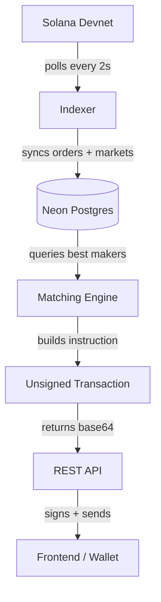

<div align="center">

# ordr-backend

indexer, matching engine, and API for [ordr.trade](https://ordr.trade) the fully on-chain CLOB on Solana.

[Website](https://ordr.trade) &nbsp;&middot;&nbsp; [X / Twitter](https://x.com/ordrtrade)


</div>

## Overview

The on-chain program handles settlement, but someone has to watch the chain, maintain a global view of the orderbook, and route taker orders to the best available makers. That is what this backend does.

It polls Solana devnet, indexes all maker market accounts and their critbit slabs into Postgres, runs a priority-sorted matching engine, and exposes a REST API. When a taker submits an order, the backend finds the best fills, constructs the unsigned `match_taker_order` instruction with all accounts resolved, and returns a base64-serialized transaction for the frontend to sign and submit.

Built by Chaos Labs as part of the Ordr initiative to build the order book infrastructure Solana has been missing.

<div align="center">

[@4rjunc](https://x.com/4rjunc) &nbsp;&middot;&nbsp; [@avhidotsol](https://x.com/avhidotsol) &nbsp;&middot;&nbsp; [@boomheadvt](https://x.com/boomheadvt) &nbsp;&middot;&nbsp; [@Vinayapr23](https://x.com/Vinayapr23)

</div>

## Architecture



## Components

| Crate path                  | What it does                                           |
| --------------------------- | ------------------------------------------------------ |
| `src/indexer/`              | Polls devnet, syncs maker slab state to Postgres       |
| `src/engine/matcher.rs`     | Queries DB, builds a priority-sorted fill plan         |
| `src/engine/transaction.rs` | Resolves all accounts, builds the unsigned instruction |
| `src/api/`                  | Axum HTTP server                                       |

## API

| Method | Route          | Description                                       |
| ------ | -------------- | ------------------------------------------------- |
| `GET`  | `/health`      | DB health check                                   |
| `GET`  | `/makers`      | List all indexed markets                          |
| `POST` | `/match_order` | Match a taker order, returns unsigned transaction |

### `POST /match_order`

Request:

```json
{
  "side": "bid",
  "size": 200,
  "limit_price": 160,
  "taker": "<wallet pubkey>",
  "taker_base_ata": "<base token account>",
  "taker_quote_ata": "<quote token account>"
}
```

- `side` `"bid"` (buying base) or `"ask"` (selling base)
- `size` amount in base token units
- `limit_price` optional. max price for bids, min price for asks. omit for market order

Response:

```json
{
  "transaction": "<base64 unsigned transaction>"
}
```

The frontend decodes this, signs with the taker's wallet, and submits to Solana.

## Setup

### Environment

```env
RPC_URL=https://api.devnet.solana.com
WS_URL=wss://api.devnet.solana.com
DATABASE_URL=postgresql://...
PROGRAM_ID=<ordr program pubkey>
BASE_MINT=<base token mint>
QUOTE_MINT=<quote token mint>
POLL_INTERVAL_MS=2000
RUST_LOG=info
```

### Commands

```bash
make run            # start the backend
make dev            # start with auto-reload (requires cargo-watch)
make build          # debug build
make build-release  # release build
make test           # run tests
make lint           # clippy, warnings as errors
make fmt            # format code
make db-migrate     # run pending migrations
```

### Test the matching engine against live DB

The `test_engine` binary is not committed to the repo. Get it from the team Discord and place it at `src/bin/test_engine.rs`, then uncomment the `[[bin]]` entry in `Cargo.toml`.

```bash
cargo run --bin test_engine
```
